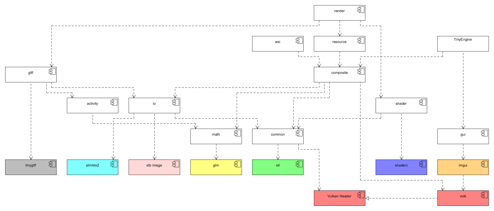

# TinyEngine for glTF 2.0 raytracing and rasterizing using Vulkan

This [R&D](https://en.wikipedia.org/wiki/Research_and_development) project is a sandbox to evaluate raytracing vs. rasterizing [glTF 2.0](https://github.com/KhronosGroup/glTF/tree/master/specification/2.0) using [Vulkan](https://www.khronos.org/vulkan/) with it's Metallic-Roughness material model.  
The TinyEngine requires Vulkan 1.2 and several extensions for raytracing. However, the TinyEngine can also be setup for Vulkan 1.0 and 1.1.

## TinyEngine architecture

## Work in Progress

### Engine  

- [ ] Refactor and cleanup render component

### glTF  
- [ ] Morphing
- [ ] Skinning

## How to build?
- [Vulkan SDK 1.2.135.0 or later](https://vulkan.lunarg.com/sdk/home)
- [NVIDIA Vulkan 1.2 Developer Beta Driver or later for raytracing](https://developer.nvidia.com/vulkan-driver)
   - NVIDIA GPU capable for raytracing
- [Eclipse C/C++ Development Tooling](https://projects.eclipse.org/projects/tools.cdt)
   - GCC for Linux
   - [MinGW64](https://www.msys2.org/) for Windows 
- [Microsoft Visual C++ 2017](https://visualstudio.microsoft.com/de/vs/older-downloads/)
   - Use [CMake](https://cmake.org/) to generate the project files
- Use [Ninja](https://ninja-build.org/) to build using [MinGW64](https://www.msys2.org/) for Windows from command line
  - Use [CMake](https://cmake.org/) to generate the project files
- Use `make` to build using `gcc` for Linux from command line
  - Use [CMake](https://cmake.org/) to generate the project files

### Build steps for Eclipse

1. Import the projects into Eclipse.
2. Select `Windows` or `Linux` build - either as `Release` or `Debug` build.
3. Build the `TinyEngine` project first.
4. Build the `Application` project.
5. Working directory is `Application` both for `Release` and `Debug` build.

## Tested platforms
- Windows 10 (64bit)
- Ubuntu 20.04 LTS (64bit)

## Used tools
- [CMake](https://cmake.org/)
- [Eclipse C/C++ Development Tooling](https://projects.eclipse.org/projects/tools.cdt)
- [Gestaltor - Visual glTF editor](https://gestaltor.io/)
- [Microsoft Visual C++ 2017](https://visualstudio.microsoft.com/de/vs/older-downloads/)
- [MSYS2](https://www.msys2.org/) on Windows  
  Execute `pacman -S mingw-w64-x86_64-gcc` to install MinGW64
- [Ninja](https://ninja-build.org/)

## Used assets
- [glTF 2.0 Sample Models](https://github.com/KhronosGroup/glTF-Sample-Models/tree/master/2.0)
- [glTF Sample Environments](https://github.com/ux3d/glTF-Sample-Environments)

## Used libraries
- [glTF Sample Viewer](https://github.com/KhronosGroup/glTF-Sample-Viewer)
- [GLFW](https://github.com/glfw/glfw)
- [glm](https://github.com/g-truc/glm)
- [imgui](https://github.com/ocornut/imgui)
- [Shaderc](https://github.com/google/shaderc)  
- [Slim KTX2](https://github.com/ux3d/slimktx2)
- [stb](https://github.com/nothings/stb)    
- [tiny glTF](https://github.com/syoyo/tinygltf)  
- [volk](https://github.com/zeux/volk)  
- [Vulkan SDK](https://vulkan.lunarg.com/)
   - Shaderc

## Limitiations by purpose
- Vulkan  
  - During minimize, the update loop is stopped.
  - Helper methods for initalization are not optimal and causing a stall on the GPU. This is done for Vulkan code simplicity.
- Tooling
  - gcc (Windows and Linux)
  - MSVC (Windows)
  - CMake (Tested MSVC, make and ninja)
  - C++17
  - 64bit only

## References
- [NVIDIA DesignWorks Samples](https://github.com/nvpro-samples/)
- [NVIDIA Vulkan Ray Tracing Tutorial](https://nvpro-samples.github.io/vk_raytracing_tutorial_KHR/)
- [Sascha's Vulkan Samples Raytracing](https://github.com/SaschaWillems/Vulkan-Samples/tree/VK_KHR_ray_tracing)
